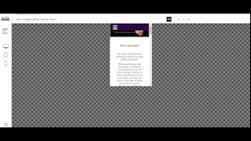

# *Your Guitar Helper*

Your guitar helper website is designed to help people initially start learning guitar, buy their first guitar that's right for them & where's best to buy said guitar. 

The site can be accessed by this [link](http://127.0.0.1:3000/index.html)

## User Stories 

### First Time Visitor Goals: 

- As a First Time Visitor, I want to easily understand the main purpose of the site and learn more about the organisation.
- As a First Time Visitor, I want to be able to easily navigate throughout the site to find content.

### Returning Visitor Goals:

- As a Returning Visitor, I want to find information about the organisation.
-  As a Returning Visitor, I want to find the best way to get in contact with the organisation with any questions I may have.
-  As a Returning Visitor, I want to find community links.

### Frequent Visitor Goals:

- As a Frequent User, I want to check to see if there are any newly added content.
- As a frequent visitor, I want to check to see if there are any newly added links to other sites.
- As a frequent visitor, I want to see if there's any additional information on guitar I can learn.

## Features 

- NavBar

- Navigation

 - Featured on all pages, the full responsive navigation bar includes links to: Home page, How to learn page, What to buy page, Where to buy page and Contact us page and is identical in each page to allow for easy navigation.

    - HOME - This link allows users to return to the home page from any page on the site.
    - HOW TO LEARN - This link allows users to navigate to the how to learn page.
    - WHAT TO BUY - This link allows users to navigate to the what to buy page.
    - WHERE TO BUY - This link allows users to navigate to the where to buy page.
    - CONTACT US - This link allows users to navigate to the contact us page.

 - The links have a hover effect to show the user that they can click on the link.
 - The navigation bar is easy for users to understand and navigate.

 

 - The navigation bar is responsive and collapses into a hamburger icon on mobile/tablet devices.

     - On Mobile/Tablet versions of the site, the navigation bar is collapsed into a hamburger icon.

     
    
    - When the hamburger icon is clicked, the navigation bar opens up vertically.

    

- Homepage
    
    - The homepage allows users to navigate the entire site.
    - Gives users a brief description of the site and what it's about.
    - Allows users to explore external links.
    - Allows users to explore the site and learn more about the guitar.
    - Allows users to contact us via the footer.
    
 

- Hero Section

     - The hero section allows users to see the main purpose of the site and what it's about
     - Allows users to see the main navigation bar
     - Allows users to see the main logo

 

- Intro Section

     - The intro section allows users to see the main purpose of the site and what it's about
     - Allows users to see the main navigation bar
     - Allows users to see the main logo

- 1st Homepage Tile Section 

     - This allows the user to navigate to internal links
     - Allows users to explore the site and learn more about the guitar
     - Allows users to see what kind of content the website consists of

     

- 2nd Homepage Tile Section

     - This allows the user to explore some external links
     - These external links are aimed to provide additional support to the user in regard to learning guitar

     

- Footer 

     -  The footer section includes links to the relevant social media sites for the organisation.
     - The footer is valuable to the user as it encourages them to keep connected via social media.
     - The footer also includes a link to the contact us page.
    
    

- How to learn page

    - The how to learn page allows users to see how to learn guitar
    - Gives top tips on achieving the best results
    - The top tips list mirrors the header image for consistency

    

- What to buy page

    - The what to buy page allows users to see what to buy when starting out
    - Gives users a list of items to buy
    - The list of items mirrors the header image for consistency

    

- Where to buy page

    - The where to buy page allows users to see where to buy the items listed on the what to buy page
    - Gives users a list of places to buy the items
    - The list of places mirrors the header image for consistency

    

- Contact us page
 
    - The contact us page allows users to contact us with any questions they may have
    - Gives users a form to fill out

    

### List of all pages

 - [Home Page](http://127.0.0.1:3000/index.html)
 - [How to learn page](http://127.0.0.1:3000/htl.html)
 - [What to buy page](http://127.0.0.1:3000/wtb.html)
 - [Where to buy page](http://127.0.0.1:3000/wheretb.html)
 - [Contact us page](http://127.0.0.1:3000/contact.html)

### Languages Used

- [HTML](https://developer.mozilla.org/en-US/docs/Web/HTML) was used as the foundation of the site.
- [CSS](https://developer.mozilla.org/en-US/docs/Web/css) was used to add the styles and layout of the site.
- [CSS Flexbox](https://developer.mozilla.org/en-US/docs/Learn/CSS/CSS_layout/Flexbox) was used to arrange items simmetrically on the pages.
- [CSS Grid](https://developer.mozilla.org/en-US/docs/Web/CSS/grid) - was used on the "Home", "What to buy", "Where to buy" pages in order to display multiple options.
- [Balsamiq](https://balsamiq.com/) was used to make wireframes for the website.
- [VSCode](https://code.visualstudio.com/) was used as the main tool to write and edit code.
- [Git](https://git-scm.com/) was used for the version control of the website.
- [GitHub](https://github.com/) was used to host the code of the website.
- [Media Queries](https://developer.mozilla.org/en-US/docs/Web/CSS/Media_Queries) were used to make the website responsive on different screen sizes.

## Design

### Colour Scheme ID Via Hex Codes

- The main color used throughout the site is 2C063F which is a purple color. This color was chosen as it's a color that's associated with music and is easy on the eye.

- The secondary color used throughout the site is FFFFFF which is a white color. This color was chosen due to it's association with a classic looking website, with good contrast to purple and black.

- The third color used throughout the site is 000000 which is a black color. This color was chosen due to it's contrasting effect against white and purple.

### Typography

- The font used within the guitar helper logo is "Tropika". This font was choosen because it adds a slight pop to the logo as opposed to mode rigid/straight line fonts. 

- The font used for the headers is "Franklin Gothic Medium". This font was chosen because it's a bold font that stands out and is easy to read. 

- The font used for the paragraphs is "Georgia". This font was chosen because it's a simple font that's easy to read.

### Credits

- Media

     - [1st Image](https://www.pexels.com/photo/person-using-black-fender-stratocaster-1656066/)

     - [2nd Image](https://www.pexels.com/photo/photo-of-man-carrying-acoustic-guitar-2462995/)

     - [3rd Image](https://unsplash.com/photos/pMCP8c8_xi4)

     - [4th Image](https://pixabay.com/photos/object-subject-coloured-background-5222329/)

     - [5th Image](https://www.youtube.com/@MartyMusic)

     - [6th Image](https://unsplash.com/photos/KsNhJk-6yk0)

     - [7th Image](https://unsplash.com/photos/a9LrwVtyiZw)

- Content

     - [TinyPNG](https://tinypng.com/) was used to compress all images.
     - [Adobe Express](https://express.adobe.com/sp/tools/) was used to compress the gif files.
     - [Code-Institute](https://github.com/Code-Institute-Org/ci-full-template) provided the template for files.
     - [Codepen](https://codepen.io/shantedenise/pen/GYyxWV) provided the base for the "Contact us" form.
     - [Font-Awesome](https://fontawesome.com/) was used for the social media icons in the footer.
     - [W3schools](https://www.w3schools.com/howto/howto_css_sidebar_responsive.asp) and [Kevin Powell][https://www.youtube.com/@KevinPowell] gave me the inspiration for the navigation bar.
     - [Canva][https://www.canva.com/] was used to create the logo.

### Testing

-  In order to confirm the correct functionality, responsiveness, and appearance:

 - The website was tested using the following browsers:

     - Google Chrome:

         

     - Firefox:

         

     - Microsoft Edge:

         

- The website was checked with [Responsive Website Design Tester.](https://responsivedesignchecker.com/)

 - Desktop Screens

     - 
     
     - 

     - 

     - 

     - 
    

 - Tablets

     - 

     - 

     - 

     - 

     - 

- Mobile Devices 
    
     - 

     - 

     - 

     - 

     - 

### Bugs

## Validator Testing

- HTML

     - Homepage  

## Accessability and perfomance

- Using lighthouse in dev tools, I can show that the site is fully accessible and has a good performance.

## Deployment

- The site was deployed to Github pages. The steps to deploy are as follows:

 - In the GitHub repository, navigate to the Settings tab
 - From the source section drop-down menu, select the Master Branch, then click "Save".
 - The page will automatically refresh. 

## Local Deployment

- In order to make a local copy of this project, you can clone it. In your IDE Terminal, type the following command to clone my repository:

     - git clone https://github.com./dmaggsy/your-guitar-helper.git

## Acknowledgements

## Wireframes 

## Desktop

## Tablets

## Mobile Devices 

[https://codepen.io/shantedenise/pen/GYyxWV]: https://codepen.io/shantedenise/pen/GYyxWV
[https://www.youtube.com/@KevinPowell]: https://www.youtube.com/@KevinPowell
[https://www.canva.com/]: https://www.canva.com/ "Canva"
[https://images.pexels.com/photos/1656066/pexels-photo-1656066.jpeg?auto=compress&amp%3Bcs=tinysrgb&amp%3Bfit=crop&amp%3Bh=1200&amp%3Bw=800]: https://images.pexels.com/photos/1656066/pexels-photo-1656066.jpeg?auto=compress&amp%3Bcs=tinysrgb&amp%3Bfit=crop&amp%3Bh=1200&amp%3Bw=800
[https://images.pexels.com/photos/2462995/pexels-photo-2462995.jpeg?auto=compress&amp%3Bcs=tinysrgb&amp%3Bfit=crop&amp%3Bh=1200&amp%3Bw=800]: https://images.pexels.com/photos/2462995/pexels-photo-2462995.jpeg?auto=compress&amp%3Bcs=tinysrgb&amp%3Bfit=crop&amp%3Bh=1200&amp%3Bw=800
[def]: https://unsplash.com/photos/pMCP8c8_xi4