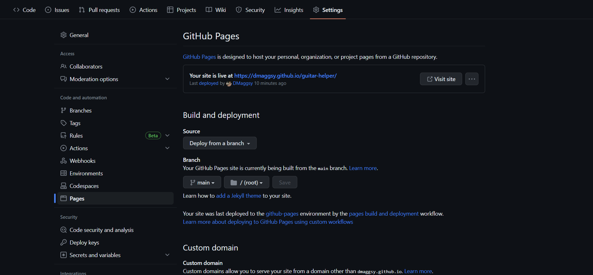
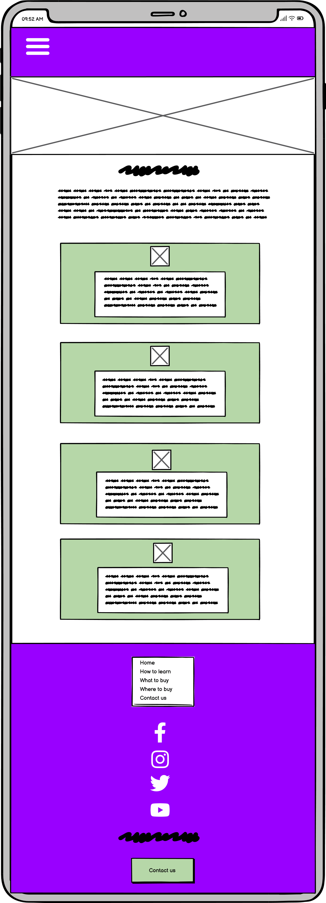

# *Your Guitar Helper*

Your guitar helper website is designed to help people initially start learning guitar, buy their first guitar that's right for them & where's best to buy said guitar. 

The site can be accessed by this [link](https://dmaggsy.github.io/guitar-helper/)

## User Stories 

### First Time Visitor Goals: 

- As a First Time Visitor, I want to easily understand the main purpose of the site and learn more about the organisation.
- As a First Time Visitor, I want to be able to easily navigate throughout the site to find content.

### Returning Visitor Goals:

- As a Returning Visitor, I want to find information about the organisation.
-  As a Returning Visitor, I want to find the best way to get in contact with the organisation with any questions I may have.
-  As a Returning Visitor, I want to find community links.

### Frequent Visitor Goals:

- As a Frequent User, I want to check to see if there are any newly added content.
- As a frequent visitor, I want to check to see if there are any newly added links to other sites.
- As a frequent visitor, I want to see if there's any additional information on guitar I can learn.

## Features 

- NavBar

- Navigation

 - Featured on all pages, the full responsive navigation bar includes links to: Home page, How to learn page, What to buy page, Where to buy page and Contact us page and is identical in each page to allow for easy navigation.

    - HOME - This link allows users to return to the home page from any page on the site.
    - HOW TO LEARN - This link allows users to navigate to the how to learn page.
    - WHAT TO BUY - This link allows users to navigate to the what to buy page.
    - WHERE TO BUY - This link allows users to navigate to the where to buy page.
    - CONTACT US - This link allows users to navigate to the contact us page.

 - The links have a hover effect to show the user that they can click on the link.
 - The navigation bar is easy for users to understand and navigate.

 

 - The navigation bar is responsive and collapses into a hamburger icon on mobile/tablet devices.

     - On Mobile/Tablet versions of the site, the navigation bar is collapsed into a hamburger icon.

     
    
    - When the hamburger icon is clicked, the navigation bar opens up vertically.

    

- Homepage
    
    - The homepage allows users to navigate the entire site.
    - Gives users a brief description of the site and what it's about.
    - Allows users to explore external links.
    - Allows users to explore the site and learn more about the guitar.
    - Allows users to contact us via the footer.
    
 

- Hero Section

     - The hero section allows users to see the main purpose of the site and what it's about
     - Allows users to see the main navigation bar
     - Allows users to see the main logo

 

- Intro Section

     - The intro section allows users to see the main purpose of the site and what it's about
     - Allows users to see the main navigation bar
     - Allows users to see the main logo

- 1st Homepage Tile Section 

     - This allows the user to navigate to internal links
     - Allows users to explore the site and learn more about the guitar
     - Allows users to see what kind of content the website consists of

     

- 2nd Homepage Tile Section

     - This allows the user to explore some external links
     - These external links are aimed to provide additional support to the user in regard to learning guitar

     

- Footer 

     -  The footer section includes links to the relevant social media sites for the organisation.
     - The footer is valuable to the user as it encourages them to keep connected via social media.
     - The footer also includes a link to the contact us page.
    
    

- How to learn page

    - The how to learn page allows users to see how to learn guitar
    - Gives top tips on achieving the best results
    - The top tips list mirrors the header image for consistency

    

- What to buy page

    - The what to buy page allows users to see what to buy when starting out
    - Gives users a list of items to buy
    - The list of items mirrors the header image for consistency

    

- Where to buy page

    - The where to buy page allows users to see where to buy the items listed on the what to buy page
    - Gives users a list of places to buy the items
    - The list of places mirrors the header image for consistency

    

- Contact us page
 
    - The contact us page allows users to contact us with any questions they may have
    - Gives users a form to fill out

    

### List of all pages

 - [Home Page](https://dmaggsy.github.io/guitar-helper/)
 - [How to learn page](https://dmaggsy.github.io/guitar-helper/htl.html)
 - [What to buy page](https://dmaggsy.github.io/guitar-helper/wtb.html)
 - [Where to buy page](https://dmaggsy.github.io/guitar-helper/wheretb.html)
 - [Contact us page](https://dmaggsy.github.io/guitar-helper/contact.html)

### Languages Used

- [HTML](https://developer.mozilla.org/en-US/docs/Web/HTML) was used as the foundation of the site.
- [CSS](https://developer.mozilla.org/en-US/docs/Web/css) was used to add the styles and layout of the site.
- [CSS Flexbox](https://developer.mozilla.org/en-US/docs/Learn/CSS/CSS_layout/Flexbox) was used to arrange items simmetrically on the pages.
- [CSS Grid](https://developer.mozilla.org/en-US/docs/Web/CSS/grid) - was used on the "Home", "What to buy", "Where to buy" pages in order to display multiple options.
- [Balsamiq](https://balsamiq.com/) was used to make wireframes for the website.
- [VSCode](https://code.visualstudio.com/) was used as the main tool to write and edit code.
- [Git](https://git-scm.com/) was used for the version control of the website.
- [GitHub](https://github.com/) was used to host the code of the website.
- [Media Queries](https://developer.mozilla.org/en-US/docs/Web/CSS/Media_Queries) were used to make the website responsive on different screen sizes.

## Design

### Colour Scheme ID Via Hex Codes

- The main color used throughout the site is 2C063F which is a purple color. This color was chosen as it's a color that's associated with music and is easy on the eye.

- The secondary color used throughout the site is FFFFFF which is a white color. This color was chosen due to it's association with a classic looking website, with good contrast to purple and black.

- The third color used throughout the site is 000000 which is a black color. This color was chosen due to it's contrasting effect against white and purple.

### Typography

- The font used within the guitar helper logo is "Tropika". This font was choosen because it adds a slight pop to the logo as opposed to mode rigid/straight line fonts. 

- The font used for the headers is "Franklin Gothic Medium". This font was chosen because it's a bold font that stands out and is easy to read. 

- The font used for the paragraphs is "Georgia". This font was chosen because it's a simple font that's easy to read.

### Credits

- Media

     - [1st Image](https://www.pexels.com/photo/person-using-black-fender-stratocaster-1656066/)

     - [2nd Image](https://www.pexels.com/photo/photo-of-man-carrying-acoustic-guitar-2462995/)

     - [3rd Image](https://unsplash.com/photos/pMCP8c8_xi4)

     - [4th Image](https://pixabay.com/photos/object-subject-coloured-background-5222329/)

     - [5th Image](https://www.youtube.com/@MartyMusic)

     - [6th Image](https://unsplash.com/photos/KsNhJk-6yk0)

     - [7th Image](https://unsplash.com/photos/a9LrwVtyiZw)

     - [8th Image](https://www.dreamstime.com/searching-bar-behind-person-s-pointed-finger-image181476473#res29250703)

     - [9th Image](https://www.freepik.com/free-photo/front-view-young-male-sitting-with-guitar-red-wall-music-performance-musician-color-applause-play-live-concert_17187172.htm)

- Guitar Grid Images 

     - [Epiphone SG](https://www.gear4music.com/Guitar-and-Bass/Epiphone-SG-Special-VE-Vintage-Cherry/1WZZ) purchasable from Gear4Music via this link.
     
     - [Epiphone Les Paul](https://www.gear4music.com/Guitar-and-Bass/Epiphone-Les-Paul-Standard-60s-Bourbon-Burst/399Y) purchasable from Gear4Music via this link.

     - [Fender Strat](https://www.gear4music.com/Guitar-and-Bass/Fender-Player-Stratocaster-HSS-MN-Polar-White/2H4X) purchasable from Gear4Music via this link.

     - [Squier Telecaster 50's Vive](https://www.guitarguitar.co.uk/product/190603344426008--squier-classic-vibe-50s-telecaster-butterscotch-blonde-maple-fi) purchasable from GuitarGuitar via this link.

     - [Epiphone Sheraton](https://www.absolutemusic.co.uk/epiphone-sheraton-ii-pro-electric-guitar-vintage-sunburst.html) purchasable from Absolute Music via this link.

     - [Fender Telecaster Player Plus](https://www.absolutemusic.co.uk/fender-player-plus-telecaster-electric-guitar-aged-candy-apple-red-mn-b-stock.html) purchasable from Absolute Music via this link.

     - [Ibanez RG GIO](https://www.absolutemusic.co.uk/ibanez-rg-gio-grgr221pa-aqb-electric-guitar-aqua-burst.html) purchasable from Absolute Music via this link.

     - [Jackson Snow White](https://www.absolutemusic.co.uk/jackson-slx-m-dx-electric-guitar-snow-white.html) purchasable from Absolute Music via this link.

     - [Ibanez RG Blue Wave](https://www.absolutemusic.co.uk/ibanez-rg-standard-rg421hpah-bwb-electric-guitar-blue-wave-black.html) purchasable from Absolute Music via this link.

- Where to buy page 

 - Image sources & links to purchasing guitars.

     - [Absolute Music](https://www.absolutemusic.co.uk/) 

     - [Gear4Music](https://www.gear4music.com/) 

     - [Guitar Village](https://www.guitarvillage.co.uk/) 

     - [Guitar Guitar](https://www.guitarguitar.co.uk/) 

     - [PMT](https://www.pmtonline.co.uk/products/guitar)

     - [Andertons](https://www.andertons.co.uk/)

     - [GAK](https://www.gak.co.uk/)

     - [Peach Guitars](https://www.peachguitars.com/)

- Icons on How to learn page

     - [Canva](https://www.canva.com/) was used to create all of these icons.

- Content

     - [TinyPNG](https://tinypng.com/) was used to compress all images.
     - [Adobe Express](https://express.adobe.com/sp/tools/) was used to compress the gif files.
     - [Code-Institute](https://github.com/Code-Institute-Org/ci-full-template) provided the template for files.
     - [Codepen](https://codepen.io/shantedenise/pen/GYyxWV) provided the base for the "Contact us" form.
     - [Font-Awesome](https://fontawesome.com/) was used for the social media icons in the footer.
     - [W3schools](https://www.w3schools.com/howto/howto_css_sidebar_responsive.asp) and [Kevin Powell](https://www.youtube.com/@KevinPowell) gave me the inspiration for the navigation bar.
     - [Canva](https://www.canva.com/) was used to create the logo.

### Manual Testing

| feature | action | expected result | tested | passed | comments |
| --- | --- | --- | --- | --- | --- |
| Navbar | Click on "Home" | User is taken to the home page | Yes | Yes | |
| Navbar | Click on "How to learn" | User is taken to the how to learn page | Yes | Yes | |
| Navbar | Click on "What to buy" | User is taken to the what to buy page | Yes | Yes | |
| Navbar | Click on "Where to buy" | User is taken to the where to buy page | Yes | Yes | |
| Navbar | Click on "Contact us" | User is taken to the contact us page | Yes | Yes | |
| Mobile Navbar | Click hamburger icon | User is presented with a vertical navigation bar | Yes | Yes | |
| Mobile Navbar | Click on "Home" | User is taken to the home page | Yes | Yes | |
| Mobile Navbar | Click on "How to learn" | User is taken to the how to learn page | Yes | Yes | |
| Mobile Navbar | Click on "What to buy" | User is taken to the what to buy page | Yes | Yes | |
| Mobile Navbar | Click on "Where to buy" | User is taken to the where to buy page | Yes | Yes | |
| Mobile Navbar | Click on "Contact us" | User is taken to the contact us page | Yes | Yes | |
| Homepage | Click on "How to learn" | User is taken to the how to learn page | Yes | Yes | |
| Homepage | Click on "What to buy" | User is taken to the what to buy page | Yes | Yes | |
| Homepage | Click on "Where to buy" | User is taken to the where to buy page | Yes | Yes | |
| Homepage | Click on "Guitar lessons with Marty" | User is taken to the Marty Music YouTube channel | Yes | Yes | |
| Homepage | Click on "18 Best guitars of 2023" | User is taken to the Guitar lobby website | Yes | Yes | |
| Homepage | Click on "Band of the month" | User gets taken to official Limp Bizkit website | Yes | Yes | |
| What to buy | Click on "Epiphone SG" | User is taken to the Epiphone SG Gear4music page | Yes | Yes | |
| What to buy | Click on "Epiphone Les Paul" | User is taken to the Epiphone Les Paul Gear4music page | Yes | Yes | |
| What to buy | Click on "Fender Strat" | User is taken to the Fender Strat Gear4music page | Yes | Yes | |
| What to buy | Click on "Squier Telecaster 50's Vive" | User is taken to the Squier Telecaster 50's Vive GuitarGuitar page | Yes | Yes | |
| What to buy | Click on "Epiphone Sheraton" | User is taken to the Epiphone Sheraton Absolute Music page | Yes | Yes | |
| What to buy | Click on "Fender Telecaster Player Plus" | User is taken to the Fender Telecaster Player Plus Absolute Music page | Yes | Yes | |
| What to buy | Click on "Ibanez RG GIO" | User is taken to the Ibanez RG GIO Absolute Music page | Yes | Yes | |
| what to buy | Click on "Jackson Snow White" | User is taken to the Jackson Snow White Absolute Music page | Yes | Yes | |
| What to buy | Click on "Ibanez RG Blue Wave" | User is taken to the Ibanez RG Blue Wave Absolute Music page | Yes | Yes | |
| Where to buy | Click on "Absolute Music" | User is taken to the Absolute Music website | Yes | Yes | |
| Where to buy | Click on "Gear4Music" | User is taken to the Gear4Music website | Yes | Yes | |
| Where to buy | Click on "Guitar Village" | User is taken to the Guitar Village website | Yes | Yes | |
| Where to buy | Click on "Guitar Guitar" | User is taken to the Guitar Guitar website | Yes | Yes | |
| Where to buy | Click on "PMT" | User is taken to the PMT website | Yes | Yes | |
| Where to buy | Click on "Andertons" | User is taken to the Andertons website | Yes | Yes | |
| Where to buy | Click on "GAK" | User is taken to the GAK website | Yes | Yes | |
| Where to buy | Click on "Peach Guitars" | User is taken to the Peach Guitars website | Yes | Yes | |
| Contact us | Enter name | User enters name | Yes | Yes | |
| Contact us | Enter email | User enters email | Yes | Yes | |
| Contact us | Enter message | User enters message | Yes | Yes | |
| Contact us | Click Accept | User accepts terms and conditions | Yes | Yes | |
| Contact us | Click on "Submit" | User gets a thank you for subkmitting message | Yes | Yes | |
| Footer | Click on "Home" | User is taken to the home page | Yes | Yes | |
| Footer | Click on "How to learn" | User is taken to the how to learn page | Yes | Yes | |
| Footer | Click on "What to buy" | User is taken to the what to buy page | Yes | Yes | |
| Footer | Click on "Where to buy" | User is taken to the where to buy page | Yes | Yes | |
| Footer | Click on "Contact us" | User is taken to the contact us page | Yes | Yes | |
| Footer | Click on "Facebook" | User is taken to the official Facebook page | Yes | Yes | |
| Footer | Click on "Twitter" | User is taken to the official Twitter page | Yes | Yes | |
| Footer | Click on "Instagram" | User is taken to the official Instagram page | Yes | Yes | |
| Footer | Click on "YouTube" | User is taken to the official YouTube page | Yes | Yes | |
| Footer | Click on "Contact us" | User is taken to the contact us page | Yes | Yes | |

### Testing

-  In order to confirm the correct functionality, responsiveness, and appearance:

 - The website was tested using the following browsers:

     - Google Chrome:

         

     - Firefox:

         

     - Microsoft Edge:

         

- The website was checked with [Responsive Website Design Tester.](https://responsivedesignchecker.com/)

 - Desktop Screens

     - 
     
     - 

     - 

     - 

     - 
    

 - Tablets

     - 

     - 

     - 

     - 

     - 

- Mobile Devices 
    
     - 

     - 

     - 

     - 

     - 

### Bugs

- Solved bugs

     - The navigation bar was not responsive on mobile devices. This was solved by adding a media query to the CSS file.
     - The contact us form was not readable on mobile due to there being no real border around the input fields. This was fixed by adding a solid border around the input fields.
     - The footer, would sometimes not stick to the bottom of the page. This was fixed by following the method presented by [Materialize](https://materializecss.com/footer.html).

- Unsolved bugs

     - App.js error appears in contact us page 

- Mistakes

     - Mistakes were made when committing changes. As this was my first project, I was not aware of the correct way to commit changes. I have since learned the correct way to commit changes and will be using this method going forward.
     

     

## Validator Testing

- HTML

 - Homepage  

     - No errors were returned when passing through the official [W3C validator](https://validator.w3.org/nu/)

     

 - How to learn page

     - No errors were returned when passing through the official [W3C validator](https://validator.w3.org/nu/)

     

 - What to buy page

     - No errors were returned when passing through the official [W3C validator](https://validator.w3.org/nu/)

     

 - Where to buy page

     - No errors were returned when passing through the official [W3C validator](https://validator.w3.org/nu/)

     

 - Contact us page

     - No errors were returned when passing through the official [W3C validator](https://validator.w3.org/nu/)

     

- CSS

 - The CSS file was checked using the official [(Jigsaw) validator](https://jigsaw.w3.org/css-validator/#validate_by_input)
 - Two errors were found in the initial CSS validation. These were:

     - Line 370: "background-color: oli", instead of the intended "background-color: olive".
     - Line 515: "Property tranform doesn't exist", instead of the intended "transform: translate(0,4px)"

- Two warnings were highlighted in the initial CSS Validation. These were:

     - ":: -webkit-input-placeholder is a vendor extended pseudo element". I am aware that the webkit may lead to some warnings/errors, however the website is working perfectly and has been tested multiple times by multiple users.
     - Line 516: "No declarations in the rule", this was due to the type on "tranform" instead of "transform".

     
     -  

- Result after fixing the above: 

     - 

 
    

## Lighthouse Testing

- Using lighthouse in dev tools, I can show that the site is fully accessible and has a good performance.

- Homepage Testing 

- How to learn Testing

- What to buy Testing

- Where to buy Testing

- Contact us Testing

## Deployment

- The site was deployed to Github pages. The steps to deploy are as follows:

1. In the GitHub repository, navigate to the Settings tab located at the top of the repository page.

2. Scroll down to the GitHub Pages section, which is usually located near the bottom of the page.

3. In the Source section, you will find a drop-down menu. Click on the drop-down menu to expand the options.

4. From the drop-down menu, select the Master Branch option. This tells GitHub Pages to use the master branch of your repository as the source for deployment.

5. Once you have selected the Master Branch option, click on the Save button.

6. The page will automatically refresh to reflect the changes you made.

7. Scroll back down to the GitHub Pages section, and you will see a notification indicating that your site is being deployed. It may take a few moments for the deployment process to complete.

8. Once the deployment process is finished, you will see a message with the URL where your site is published. It will typically be in the format https://<your-github-username>.github.io/<repository-name>, where <your-github-username> is your GitHub username and <repository-name> is the name of your repository.

9. Click on the URL to verify that your site has been successfully deployed. The link should open your site in a new browser tab.

## Local Deployment

- In order to make a local copy of this project, you can clone it. In your IDE Terminal, type the following command to clone my repository:

     - git clone https://github.com./dmaggsy/your-guitar-helper.git

## Future Implementations

1. Custom 404 Page
 - A custom 404 page will be implemented to provide a user-friendly experience when visitors encounter a page that cannot be found. The 404 page will include relevant information, such as an apology message, suggestions for navigation, and a search bar to help users find the content they were looking for.

2. Favicon
 - A favicon will be added to enhance the website's branding and visual appeal. The favicon is a small icon that appears in the browser tab and bookmarks. It helps users quickly identify and locate your website among their open tabs or saved bookmarks.

3. Fully Functional Contact Us Form
 - The existing contact us form, which is currently only visually designed, will be upgraded to a fully functional form. This improvement will allow visitors to submit inquiries, feedback, or requests directly from the website. The form will be integrated with a backend system to ensure that submissions are properly received and processed. Upon submission, users will receive confirmation messages or email notifications to acknowledge their contact requests.

## Wireframes 

## Desktop

## Tablets

## Mobile Devices 

